

# 论文笔记

## **Quo Vadis, Action Recognition? A New Model and the Kinetics Dataset**

---
* Carreira J, Zisserman A. Quo vadis, action recognition? a new model and the kinetics dataset [C] proceedings of the IEEE Conference on Computer Vision and Pattern Reco

### 阅读动机
经典的I3D模型的出处。

### 简述

本文借鉴 ImageNet 的思想：处理二维图像是可以将一个在巨大的数据集中预训练过的优秀且鲁棒模型的模型拿到较小的数据集中进行 fine-tuning 可以获得优于直接从小数据集中训练出来的模型，在小数据集中简单模型性能可能达不到要求，而复杂模型则没有足够的数据进行训练。希望在对视频的处理中（动作识别）也构建这样一个巨大的数据集以及优秀且鲁棒的模型，于是提出了 I3D 模型和 Kinetics 数据集，并与当时流行的比较优秀的模型也在 Kinetics 数据集上进行与训练，然后分别在两个小的动作识别数据集 HMDB-51 和 UCF-101 上进行 fine-tuning 后测试并比较，把它们 outperform 掉。

### Abstact
The paucity of videos in current action classification
datasets (UCF-101 and HMDB-51) has made it difficult
to identify good video architectures, as most methods obtain similar performance on existing small-scale benchmarks. This paper re-evaluates state-of-the-art architectures in light of the new Kinetics Human Action Video
dataset. Kinetics has two orders of magnitude more data,
with 400 human action classes and over 400 clips per
class, and is collected from realistic, challenging YouTube
videos. We provide an analysis on how current architectures
fare on the task of action classification on this dataset and
how much performance improves on the smaller benchmark
datasets after pre-training on Kinetics.
We also introduce a new Two-Stream Inflated 3D ConvNet (I3D) that is based on 2D ConvNet inflation: filters and pooling kernels of very deep image classification ConvNets are expanded into 3D, making it possible
to learn seamless spatio-temporal feature extractors from
video while leveraging successful ImageNet architecture
designs and even their parameters. We show that, after
pre-training on Kinetics, I3D models considerably improve
upon the state-of-the-art in action classification, reaching
80.2% on HMDB-51 and 97.9% on UCF-101.

### 动作识别模型
随着 2D 卷积模型日渐成熟，现有的视频处理主要分别是 2D 核和 3D 核的区别，其中 2D 核 一般有 RNN 的 LSTM ，以及一些双流融合的模型，3D 核的有 C3D 。因为 3D 卷积的参数量巨大，并且可用数据集十分有限，以前的 3D 卷积结构层数十分浅（ C3D 只有 8 层）。观察到深度网络结构（ Inception, VGG-16, ResNet ）都可以膨胀（inflate）来做时空特征提取。

以下用传统的方式构建 3 时空特征提取的模型，再本文提出的 I3D 模型。为了可比性，大家都用带有 BN 的 Inception-V1 作为 back bone。

#### 1. ConvNet + LSTM

在带有 BN 的 Inception-V1 最后的 average pooling 层加一个层 $512$ 个节点的隐层，再加 $1$ 个全连接输出层做维分类

#### 2. 3D ConvNets

3D ConvNets 的缺点是不能使用 ImageNet 进行预训练，这里使用一个根据 C3D 修改的模型，$8$ 个卷积层，$5$ 个池化层，输入是一个 $16$ 帧的 $112×122$ 的短片，与 C3D 不同的是在所有的卷积层和全连接层后都加上 BN ，另一个不同之处是把第一个池化层的 stride 从 $1$ 改成 $2$ ，这样节省内存来使用更大的 batch 

#### 3. Two-Stream Networks

用 Inception-V1 输入相隔 $10$ 帧采样的 $5$ 帧 RGB 图像，对应的光流数据一起输入模型中，在最后一个 average pooling 前的 spatial 和 motion 要经过一个 $3×3×3$ 的卷积，输出 $512$ 个通道，然后再经过一个 $3×3×3$ 的 max-pooling层和一个全连接层。所有新层的权值都用 Gaussian noise 初始化。

#### 4. Two-Stream Inflated 3D ConvNets

* Inflating 2D ConvNets into 3D

    把 2D 的卷积核扩展为 3D 的，比如 $N×N$ 变成 $N×N×N$ ，增加时间上的维度

* Bootstrapping 3D filters from 2D Filters

    考虑如果把一张 2D 图像通过复制很多帧成为一段视频，用 $N×N×N$ 的卷积核进行卷积得到的值应该与 $N×N$ 的 2D 卷积得到的值一样，那么可以把 2D 卷积核复制 $N$ 份，然后把所有的值除以 $N$

* Pacing receptive field growth in space, time and network depth

    特征的感受也在网络中处于越深的位置，其感受野就越宽，通常都是对长宽两个维度是进行同等处理的，但在这里，在时间维度上并不能跟长宽进行同等处理，因为同样在不同的帧率下，同样的帧数对应的时间并不相同，因此，这里需要根据具体的视频来具体考虑

根据 Inception-V1 改进的 I3D 模型如下图所示
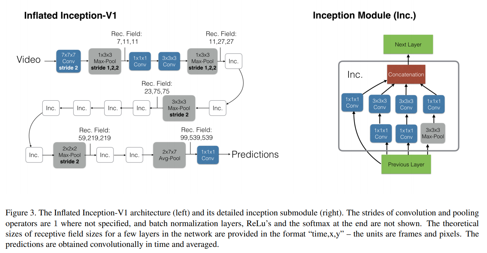
### 实验对比

作者在前文提到的三个数据集上进行了三种实验，首先在 Kinetics 上把模型进行与训练

1. 直接在其他两个数据集的测试集上使用（Original）

2. 固定网络参数，在用其他两个数据集的训练集上训练分类器后再用测试集测试(Fixed)

3. 在其他两个数据集上进行 fine-turn 网络以及训练分类器(Full-FT)

可见无论是何种测试方式，I3D 都 outperform 其他的模型。

* 别的模型在其他两个数据集上都是光流的贡献更大，而 Kinestics 上则是 RGB 的贡献更大，说明 Kinetics 数据集上图像动作更明显些，也更说明 I3D 拥有很强的图像上动作的捕捉能力

* 从 MiniKinetics 到 Kinetics 的提升说明 3D ConvNet 需要大量的数据来训练出鲁棒的动作捕捉能力

## **Deep Reinforcement Learning with Double Q-learning**

---

* Van Hasselt, Hado, Arthur Guez, and David Silver. "Deep reinforcement learning with double q-learning." Proceedings of the AAAI Conference on Artificial Intelligence. Vol. 30. No. 1. 2016.

### 阅读动机

Double Q-learning 是一个对 Q-learning 学习质量的重要改进。

### 简述

当时现有的 Q-learning 的强化学习方法都普遍存在对 action-value 的 overestimate 问题，本文通过理论推导加上实例证明 overestimate 问题不仅会导致 action-value 的过高估计，还会阻碍对最右策略的学习，限制模型的表现，随后本文提出 Double Q-learning 来解决了 Overestimate 问题，实际上就是把 Q-learning 中 target value 的计算中的动作选择和价值估计进行解耦，这个改进解决了 overestimate 问题，并在提升 DQN 在 Atari 游戏上的表现。

### Abstract

The popular Q-learning algorithm is known to overestimate
action values under certain conditions. It was not previously
known whether, in practice, such overestimations are common, whether they harm performance, and whether they can
generally be prevented. In this paper, we answer all these
questions affirmatively. In particular, we first show that the
recent DQN algorithm, which combines Q-learning with a
deep neural network, suffers from substantial overestimations
in some games in the Atari 2600 domain. We then show that
the idea behind the Double Q-learning algorithm, which was
introduced in a tabular setting, can be generalized to work
with large-scale function approximation. We propose a specific adaptation to the DQN algorithm and show that the resulting algorithm not only reduces the observed overestimations, as hypothesized, but that this also leads to much better
performance on several games.

### Double Q-learning

传统的 Q-learning 的 target 计算方式如下

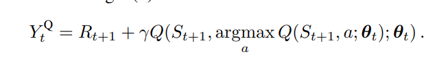

价值估计和动作选择同的是同一个 $Q$ 很容易导致过度乐观问题。

传统的 Q-learning 中只用一个表进行价值估计和动作选择，如果把价值估计和动作选择分离开，即两个同样的 $Q$ ，每次学习等概率的把任务分配给其中一个，并只在价值估计的 $Q$ 上进行学习，就极大的缓解这个问题。

新的 target 计算方式如下

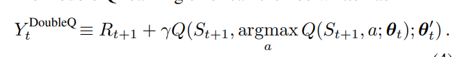

### 估计误差造成的过度乐观

以下通过该引理证明了在学习过程中无论什么噪声都会导致传统 Q-learning 出现过度乐观问题，并给出了误差下界。实际就是即使均值是无偏差的，问题依然存在，因为有了 MAX 操作。

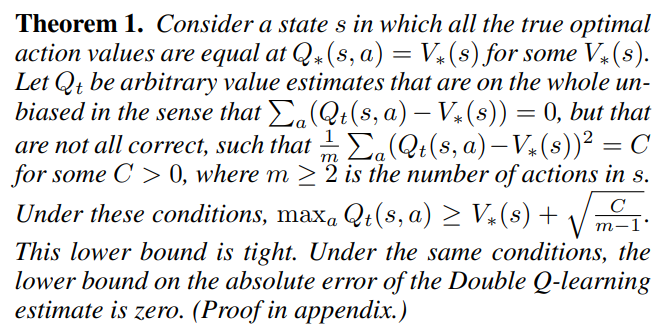

以下通过一个实例展现了过度乐观的形成

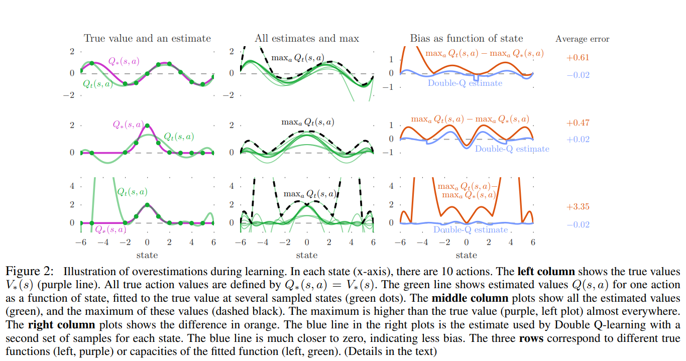

第一行：用 $6$ 阶对 $sin(s)$ 进行近似

第二行：用 $6$ 阶对 $2^{-s^2}$ 进行近似

第三行：用 $9$ 阶对 $2^{-s^2}$ 进行近似

中间一列是不同的采样点进行多个近似

右边一列是对多个近似取 MAX ，对比原函数可以看出对过度乐观效应

### Double DQN

DQN 本身就存在两个 $Q$ 网络，因此只需进行很小的改动就可以实现 Double DQN ，即把 target 的计算变成如下

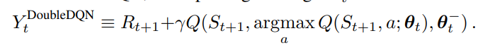

实际就是用 最新的网络来进行动作选择，用旧网络进行价值估计，原本是二者都在旧网络上进行。

这便实现来了不改变模型的情况下，实现了 Double DQN

### 实验总结

本文通过实验结果总结出 overestimate 不但鲁棒性不强，不稳定性还可能导致学习到不好的策略，Double DQN 极大的减少了 overestimate 效应，使得学习曲线更加的稳定，增强了模型的鲁棒性，还可以学习到更好的策略，并且获得更好的表现！

## **PRIORITIZED EXPERIENCE REPLAY**

---
* Schaul, Tom, et al. "Prioritized experience replay." arXiv preprint arXiv:1511.05952 (2015).

### 阅读动机

针对强化学习的 sample 方法的一个重要的优化

### 简述

传统的强化学习中运用 experience replay 来解除 transition 间的相关性，把最近的一些 transition 存到一个 replay buffer 里，然后再在里面随机抽取一些组成 batch 来对模型进行训练。然而这里没有考虑到这些 transition 的质量，可能部分 transition 对模型的优化并有太大的作用，就是有些对策略优化作用不大的经验占据了 replay buffer 。本文提出了给 transition 安上优先级，优先学习那些对策略优化更有用的 transition ，以此极大提高了学习的速度，还有改善学习的策略质量。

### Abstract

Experience replay lets online reinforcement learning agents remember and reuse
experiences from the past. In prior work, experience transitions were uniformly
sampled from a replay memory. However, this approach simply replays transitions
at the same frequency that they were originally experienced, regardless of their
significance. In this paper we develop a framework for prioritizing experience,
so as to replay important transitions more frequently, and therefore learn more
efficiently. We use prioritized experience replay in Deep Q-Networks (DQN), a
reinforcement learning algorithm that achieved human-level performance across
many Atari games. DQN with prioritized experience replay achieves a new stateof-the-art, outperforming DQN with uniform replay on 42 out of 57 games.

###  temporal-difference (TD) error

TD error  就是 DQN 中的 $|\delta|$ 计算如下

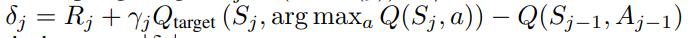

优先级就是根据 $|\delta|$ 进行设置的

### PRIORITIZING WITH TD-ERROR

* 对每个 transition 记录最近一次进行 replay 时的 TD error
* 每次取具有最大的 TD error 的 transiton 进行 replay
* 对于新来的 transition 设置为最高优先级，以便于得到它的 TD error

### 随机优先

优先级的设置往往都会遇到一些问题，其中的一个就是低优先级的 transition 很长时间得不到或者永远得不到 replay 。还有就是这导致模型对噪声的敏感性增加。同时还导致样本缺少多样性，学习不到真实的分布，造成过拟合。

为了解决这些问题，文中提出了随机优先的采样策略，让采样策略介于随机采样和贪心采样之间。本文提出两种随机优先的方法

#### proportional prioritization

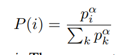

上图是每个 transition 被采样的概率，其中 $p_i = |\delta| + \epsilon$ 是每个 tansition 的优先级，$\alpha$ 是控制优先级的使用程度，如果 $\alpha = 0$ 就等同于一般的随机采样。

#### rank-based prioritization

$p_i = \frac{1}{rank(i)}$

以下使用 prioritized replay 的 DQN 的算法

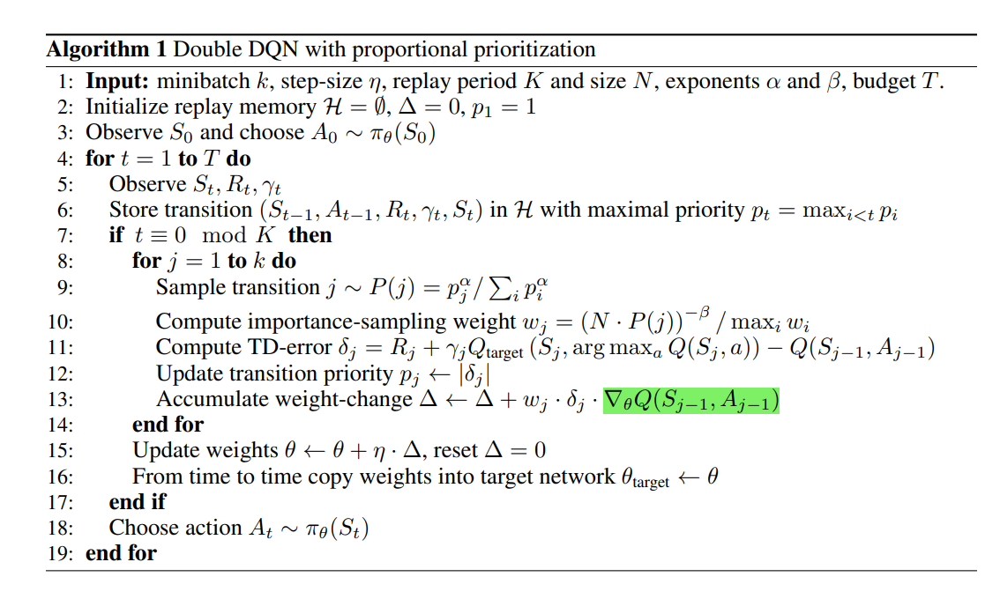

### 减退偏差

随机更新是关键是 batch 的分布跟真实数据的分布相同，优先级由于打破了这种分布，引入了偏差，这可能改变最后收敛的 solution 。这是一个需要解决的问题。

解决的方法是更新网络是用的 $\delta$ 该为 $\omega_i\delta_i$ 并通过控制 $\beta$ 来控制 $\omega$ ， $\omega$ 的定义如下，当 $\beta = 1$ 时优先级就没有了作用，这种方法被称为 Importance-sampling 。

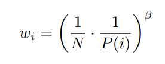

同时增加 $\alpha$ 和 $\beta$ 可以让优先选择效果逐渐增加而又逐渐减弱更新力度。

同梯度下降法相似，当步长足够短时，及时估计存在一阶偏差，最后也可以收敛到正确的最值。因此训练时的做法是把 $\alpha$ 和 $\beta$ 同时逐渐趋近于 $1$ 。这样在训练过程中，优先选择效果不断提升，而步长逐渐缩小，可以有效的抑制偏差的出现，在最后收敛到无偏差的 solution。

### 扩展

优先的概念可以扩展到强化学习以外的范围，比如监督学习中可以对样本进行优先级处理，加快学习速率，同时在样本不平衡的情况下，少得一类还会因为学习不够而产生较高的优先级，指导模型更多去学习，缓解样本不平衡带来的偏差。

除了优先采样外，优先级的概念还可以用于 replay buffer 的管理，即把对哪些样本进行采样扩展到对哪些样本进行存储，把没有什么学习价值的样本丢弃，只存储那些学习价值高的，这样可以节省内存的使用。

## **Noisy Networks for Exploration**

---
* Fortunato, Meire, et al. "Noisy networks for exploration." arXiv preprint arXiv:1706.10295 (2017).
  
### 阅读动机

对强化学习搜索策略的一个重要优化

### 简述

强化学习中对环境的探索是学习的前提，当时现有的探索策略大多都是随机探索，并且人工进行调参，如 $\epsilon$-greedy 这些随机算法，没有一种普适的可学习的优秀探索策略，本文就此进行研究，提出了在网络中加噪声的方式的 NoisyNet 模型。

### Abstract

We introduce NoisyNet, a deep reinforcement learning agent with parametric noise
added to its weights, and show that the induced stochasticity of the agent’s policy
can be used to aid efficient exploration. The parameters of the noise are learned
with gradient descent along with the remaining network weights. NoisyNet is
straightforward to implement and adds little computational overhead. We find that
replacing the conventional exploration heuristics for A3C, DQN and dueling agents
(entropy reward and -greedy respectively) with NoisyNet yields substantially
higher scores for a wide range of Atari games, in some cases advancing the agent
from sub to super-human performance.

### NoisyNets for Reinforcement Learning

设 $y = f_{\theta}(x),\theta = \mu + \sigma \odot \epsilon , \zeta = (\mu, \sigma)$ 

把 $y = \omega x + b$ 改为 $y = (\mu^{\omega} + \sigma^{\omega} \odot\epsilon^{\omega})x + (\mu^b + \sigma^b \odot\epsilon^b)$

其中 $\mu , \sigma$ 是可学习参数，$\epsilon^{\omega}, \epsilon^b$ ,是 zero-mean 的向量和矩阵。

$\epsilon$ 的构造方法有两种

对于$p$ 维的输入， $q$ 维的输入

* 每个 $\epsilon_{i,j}$ 独立来自一个高斯分布，这样有

* 分解高斯噪声，对于输入有一个 $p$ 个 $\epsilon_i$ , 输出有 $q$ 个 $\epsilon_j$ ，取 $\epsilon^{\omega}_{i,j} =f(\epsilon_i)f(\epsilon_j)$ ，$\epsilon^b_j = f(\epsilon^b_j)$ ，其中 $f$ 为一个函数，本文中 $f=sgn(x) \sqrt{|x|}$

损失函数如下

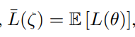

即对网络的输出的期望，运用蒙特卡洛来近似

### NosiyNet-DQN

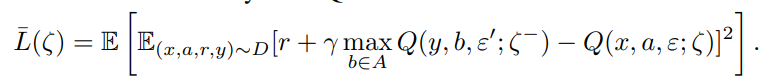

其算法如下

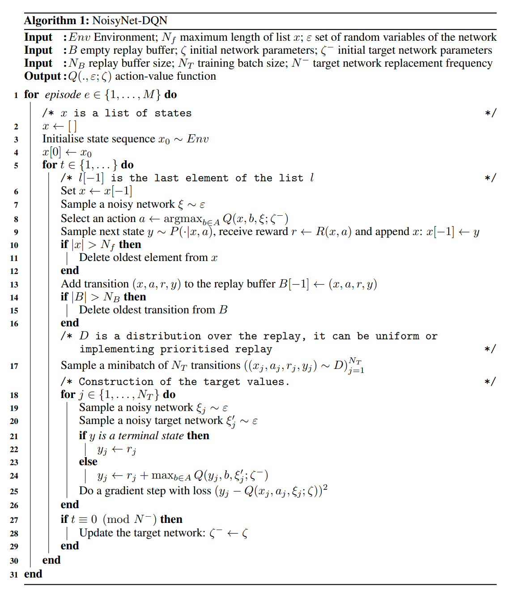

