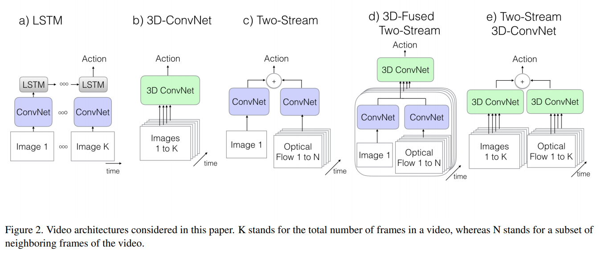
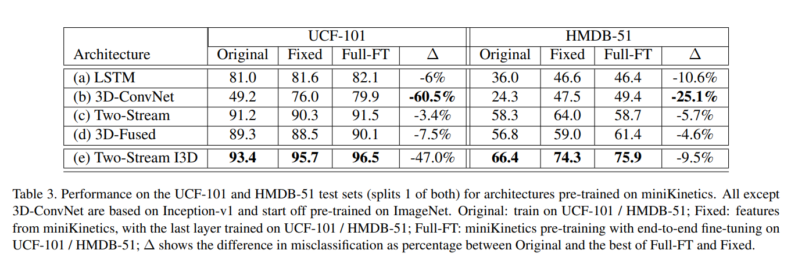

# 论文笔记

## Quo Vadis, Action Recognition? A New Model and the Kinetics Dataset
---
* Carreira J, Zisserman A. Quo vadis, action recognition? a new model and the kinetics dataset [C] proceedings of the IEEE Conference on Computer Vision and Pattern Reco

### 为什么读
经典的I3D模型的出处。

### 简述

本文借鉴 ImageNet 的思想：处理二维图像是可以将一个在巨大的数据集中预训练过的优秀且鲁棒模型的模型拿到较小的数据集中进行 fine-tuning 可以获得优于直接从小数据集中训练出来的模型，在小数据集中简单模型性能可能达不到要求，而复杂模型则没有足够的数据进行训练。希望在对视频的处理中（动作识别）也构建这样一个巨大的数据集以及优秀且鲁棒的模型，于是提出了 I3D 模型和 Kinetics 数据集，并与当时流行的比较优秀的模型也在 Kinetics 数据集上进行与训练，然后分别在两个小的动作识别数据集 HMDB-51 和 UCF-101 上进行 fine-tuning 后测试并比较，把它们 outperform 掉。

### Abstact
The paucity of videos in current action classification
datasets (UCF-101 and HMDB-51) has made it difficult
to identify good video architectures, as most methods obtain similar performance on existing small-scale benchmarks. This paper re-evaluates state-of-the-art architectures in light of the new Kinetics Human Action Video
dataset. Kinetics has two orders of magnitude more data,
with 400 human action classes and over 400 clips per
class, and is collected from realistic, challenging YouTube
videos. We provide an analysis on how current architectures
fare on the task of action classification on this dataset and
how much performance improves on the smaller benchmark
datasets after pre-training on Kinetics.
We also introduce a new Two-Stream Inflated 3D ConvNet (I3D) that is based on 2D ConvNet inflation: filters and pooling kernels of very deep image classification ConvNets are expanded into 3D, making it possible
to learn seamless spatio-temporal feature extractors from
video while leveraging successful ImageNet architecture
designs and even their parameters. We show that, after
pre-training on Kinetics, I3D models considerably improve
upon the state-of-the-art in action classification, reaching
80.2% on HMDB-51 and 97.9% on UCF-101.

### 动作识别模型
随着 2D 卷积模型日渐成熟，现有的视频处理主要分别是 2D 核和 3D 核的区别，其中 2D 核 一般有 RNN 的 LSTM ，以及一些双流融合的模型，3D 核的有 C3D 。因为 3D 卷积的参数量巨大，并且可用数据集十分有限，以前的 3D 卷积结构层数十分浅（ C3D 只有 8 层）。观察到深度网络结构（ Inception, VGG-16, ResNet ）都可以膨胀（inflate）来做时空特征提取。

以下用传统的方式构建 3 时空特征提取的模型，再本文提出的 I3D 模型。为了可比性，大家都用带有 BN 的 Inception-V1 作为 back bone。

#### 1. ConvNet + LSTM

在带有 BN 的 Inception-V1 最后的 average pooling 层加一个层 $512$ 个节点的隐层，再加 $1$ 个全连接输出层做维分类

#### 2. 3D ConvNets

3D ConvNets 的缺点是不能使用 ImageNet 进行预训练，这里使用一个根据 C3D 修改的模型，$8$ 个卷积层，$5$ 个池化层，输入是一个 $16$ 帧的 $112×122$ 的短片，与 C3D 不同的是在所有的卷积层和全连接层后都加上 BN ，另一个不同之处是把第一个池化层的 stride 从 $1$ 改成 $2$ ，这样节省内存来使用更大的 batch 

#### 3. Two-Stream Networks

用 Inception-V1 输入相隔 $10$ 帧采样的 $5$ 帧 RGB 图像，对应的光流数据一起输入模型中，在最后一个 average pooling 前的 spatial 和 motion 要经过一个 $3×3×3$ 的卷积，输出 $512$ 个通道，然后再经过一个 $3×3×3$ 的 max-pooling层和一个全连接层。所有新层的权值都用 Gaussian noise 初始化。

#### 4. Two-Stream Inflated 3D ConvNets

* Inflating 2D ConvNets into 3D

    把 2D 的卷积核扩展为 3D 的，比如 $N×N$ 变成 $N×N×N$ ，增加时间上的维度

* Bootstrapping 3D filters from 2D Filters

    考虑如果把一张 2D 图像通过复制很多帧成为一段视频，用 $N×N×N$ 的卷积核进行卷积得到的值应该与 $N×N$ 的 2D 卷积得到的值一样，那么可以把 2D 卷积核复制 $N$ 份，然后把所有的值除以 $N$

* Pacing receptive field growth in space, time and network depth

    特征的感受也在网络中处于越深的位置，其感受野就越宽，通常都是对长宽两个维度是进行同等处理的，但在这里，在时间维度上并不能跟长宽进行同等处理，因为同样在不同的帧率下，同样的帧数对应的时间并不相同，因此，这里需要根据具体的视频来具体考虑

### 实验对比

作者在前文提到的三个数据集上进行了三种实验，首先在 Kinetics 上把模型进行与训练

1. 直接在其他两个数据集的测试集上使用（Original）
   
2. 固定网络参数，在用其他两个数据集的训练集上训练分类器后再用测试集测试(Fixed)
3. 在其他两个数据集上进行 fine-turn 网络以及训练分类器(Full-FT)

可见无论是何种测试方式，I3D 都 outperform 其他的模型。
