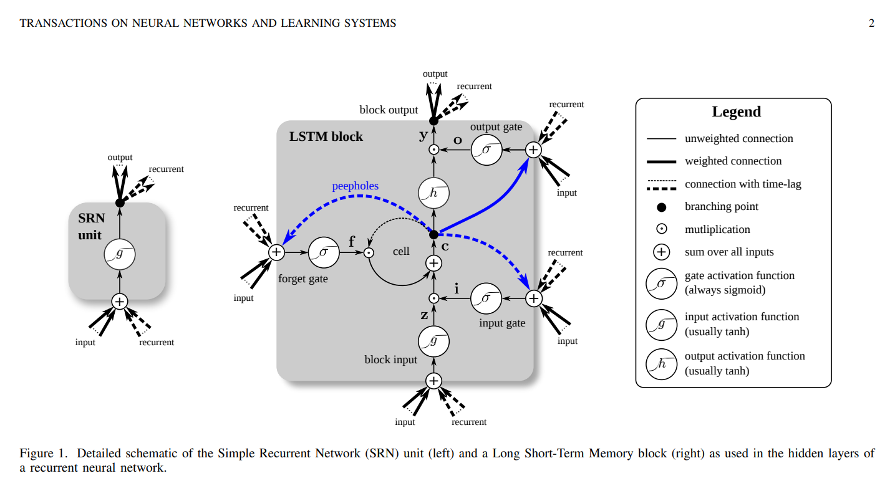
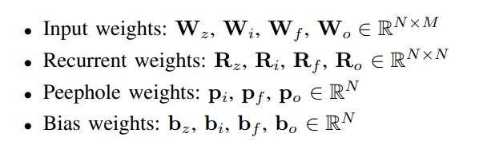
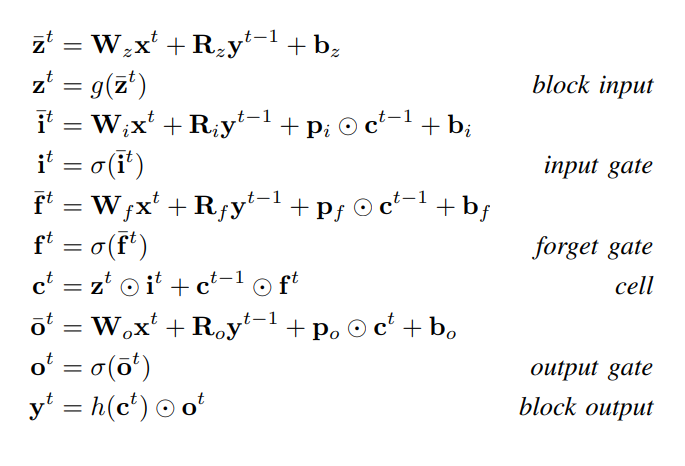
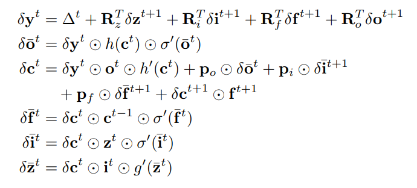

## **LSTM: A Search Space Odyssey**

---

### 阅读动机

了解 RNN 的经典模型 LSTM

### 简述

LSTM 模型自提出依赖一直没有一个比较标准的具体模型，有很多变体，但关于哪个版本具有更优秀的性能并没有人做过想要的研究。也由于变体太多，做这样的对比实验需要十分恐怖的计算量，本文对 vanilla LSTM 模型与其 $8$ 种变体的 LSTM 模型在三个数据集上做了实验，并分析了各个改动的对模型的影响，希望找出一个比较优秀的 LSTM 模型。但结果发现，没有任何一个变体的表现明显超过了 vanilla LSTM ，但有简化的版本也做到了 vanilla LSTM 的表现，并且得到计算上的简化。

### Abstrace

Several variants of the Long Short-Term Memory
(LSTM) architecture for recurrent neural networks have been
proposed since its inception in 1995. In recent years, these
networks have become the state-of-the-art models for a variety
of machine learning problems. This has led to a renewed interest
in understanding the role and utility of various computational
components of typical LSTM variants. In this paper, we present
the first large-scale analysis of eight LSTM variants on three
representative tasks: speech recognition, handwriting recognition,
and polyphonic music modeling. The hyperparameters of all
LSTM variants for each task were optimized separately using
random search, and their importance was assessed using the
powerful fANOVA framework. In total, we summarize the results
of 5400 experimental runs (≈ 15 years of CPU time), which
makes our study the largest of its kind on LSTM networks.
Our results show that none of the variants can improve upon
the standard LSTM architecture significantly, and demonstrate
the forget gate and the output activation function to be its
most critical components. We further observe that the studied
hyperparameters are virtually independent and derive guidelines
for their efficient adjustment.
Index Terms—Recurrent neural networks, Long Short-Term
Memory, LSTM, sequence learning, random search, fANOVA.

### vanilla LSTM

上如是 LSTM 很常见的单元，有输入门，输出门，遗忘门，还有窥探。

所有的参数如下

于是单元的数学表达如下，其中 $\sigma$ 表示 sigmoid 函数，$g,h$ 都是双曲正切 $tanh$ 用于把数值变换到 $[-1,1]$  

反向传播方法 Backpropagation Through Time ，其中 $\Delta^t$ 表示从上面传下来的梯度

